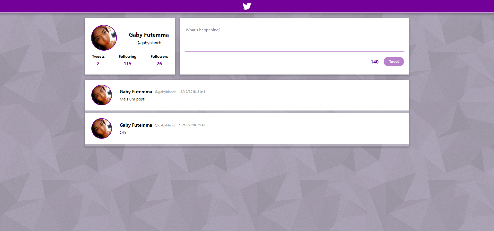

# Twitter

## Motivo
Este é um desafio do Sprint 2 do bootcamp Laboratoria.

O desafio era criar uma versão para desktop simplificada do Twitter, contendo uma área para postar, contador de caracteres, timeline para ver as mensagens postadas e as mensagens deveriam ter data e hora.

## Aparência

